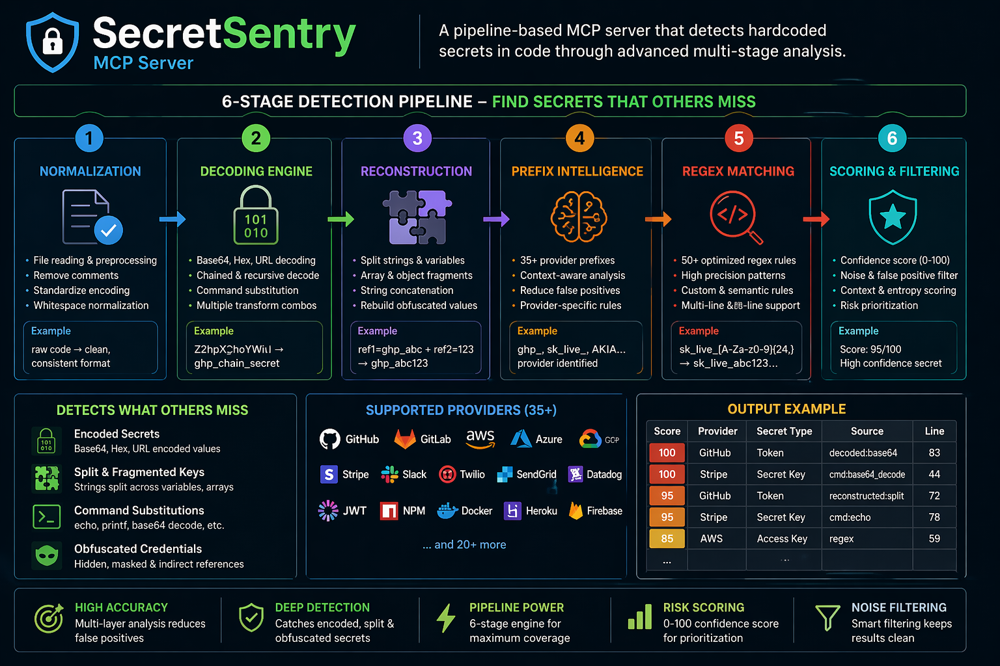

# 🔐 SecretSentry

A pipeline-based MCP server that detects hardcoded secrets, credentials, API keys, and risky values in your code — even when they're encoded, split, obfuscated, or hidden inside command substitutions. Powered by a 6-stage detection pipeline with confidence scoring that separates real threats from noise.



## Why

One leaked secret in Git history can cost you. SecretSentry catches them before that happens — right inside your IDE via the Model Context Protocol. Unlike simple regex scanners, SecretSentry decodes base64, hex, and URL-encoded values, reconstructs split secrets, simulates command substitutions, and uses prefix intelligence from 35+ providers to catch what others miss.

## Tools

| Tool | Description |
|------|-------------|
| `scan_code` | Scan a code snippet pasted in chat |
| `scan_file` | Scan a file on disk by path |
| `scan_directory` | Scan an entire project (skips binaries, node_modules, .git, build dirs) |
| `check_entropy` | Analyze a string's Shannon entropy + prefix intelligence |

## 6-Stage Detection Pipeline

```
Raw Code
  → Stage 1: NORMALIZATION    (unicode decode, hex escapes, confusable chars)
  → Stage 2: DECODING         (base64, hex, URL, chained transforms, command substitution)
  → Stage 3: RECONSTRUCTION   (string concat, split assignments, array splits)
  → Stage 4: PREFIX INTEL     (35+ provider prefix database)
  → Stage 5: REGEX MATCHING   (50+ pattern rules)
  → Stage 6: SCORING          (confidence 0-100, noise filtering)
  → Output: Findings in tabular format, sorted by confidence
```

### Stage 1: Normalization
- Unicode escape decoding (`\u0061` → `a`)
- Hex escape decoding (`\x67\x68\x70` → `ghp`)
- Unicode confusable normalization (Cyrillic `р` → Latin `p`)
- Smart quote normalization

### Stage 2: Decoding + Chained Transforms
- Base64 decoding (standard + URL-safe)
- Hex decoding (`4a776f7264...` → `Jword1234...`)
- URL percent-encoding (`ghp%5Ftoken` → `ghp_token`)
- Chained transforms up to 3 layers deep (base64 → JSON → base64)
- Command substitution simulation:
  - `$(echo BASE64 | base64 --decode)` → decoded value
  - `` `echo BASE64 | base64 --decode` `` → decoded value
  - `echo VALUE | rev` → reversed value
  - `echo "secret_value"` → extracted value

### Stage 3: Reconstruction
- String concatenation (`"sk_live_" + suffix`)
- Sequential split assignments (`part1=sk_live_51H`, `part2=xxABC`)
- Array-style splits (`keys[0]=AIza`, `keys[1]=SyD`)

### Stage 4: Prefix Intelligence
35+ known provider prefixes with metadata:

| Provider | Prefixes |
|----------|----------|
| AWS | `AKIA`, `ABIA`, `ACCA`, `ASIA` |
| Google | `AIza` |
| GitHub | `ghp_`, `gho_`, `ghu_`, `ghs_`, `ghr_` |
| GitLab | `glpat-` |
| Stripe | `sk_live_`, `rk_live_`, `sk_test_`, `pk_live_`, `whsec_` |
| Slack | `xoxb-`, `xoxp-`, `xoxa-`, `xoxr-` |
| SendGrid | `SG.` |
| Square | `sq0atp-`, `sq0csp-` |
| Twilio | `SK`, `AC` |
| Shopify | `shpat_`, `shpca_`, `shppa_` |
| PyPI | `pypi-` |
| npm | `npm_` |
| DigitalOcean | `dop_v1_` |
| Cloudflare | `v2.` |
| Mailgun | `key-` |
| JWT | `eyJ` |
| Amazon MWS | `amzn.mws.` |

Prefix intelligence runs on raw values, decoded values, AND reconstructed values — catching secrets across all pipeline stages.

### Stage 5: Regex Pattern Matching (50+ Rules)

Covers: AWS, GCP, Azure, GitHub, GitLab, Stripe, PayPal, Square, Slack, Discord, Twilio, SendGrid, Mailgun, Datadog, New Relic, Sentry, MongoDB/Postgres/MySQL/Redis connection strings, JDBC, private keys (RSA/EC/DSA/OpenSSH/PGP), JWTs, hardcoded passwords/secrets/tokens/encryption keys, URLs with credentials, npm/PyPI/Docker tokens, Android-specific patterns, and high-entropy catch-all.

### Stage 6: Confidence Scoring + Noise Filtering

Every finding gets a 0-100 confidence score from 8 factors:

| Factor | Effect |
|--------|--------|
| Base score | Rule-specific starting score (15-98) |
| Entropy + Length combined | High entropy + long = strong signal (+20), low entropy + long = noise (-35 to -50) |
| Keyword proximity | Line contains "password", "secret", "token", etc. (+10) |
| Context penalties | Test file (-25), placeholder (-40), comment (-20), env var ref (-30), example/dummy (-20) |
| Noise detection | Repeating chars (-50), all-lowercase low-entropy (-20), all-digits (-25), sequential patterns (-15) |
| Nearby context | Multiple secret-related lines nearby (+5) |
| Combined signal | High entropy + sensitive keyword + not test file (+5) |
| Pipeline source bonus | Decoded/reconstructed secrets get +5 (hidden = more suspicious) |

Severity derived from score:

| Score | Severity | Emoji |
|-------|----------|-------|
| 90-100 | CRITICAL | 🚨 |
| 70-89 | HIGH | 🔴 |
| 50-69 | MEDIUM | 🟡 |
| 30-49 | LOW | 🟢 |
| 0-29 | INFO | ℹ️ |

Findings below confidence 15 are suppressed. Results split into "Confirmed" and "Candidates" tables.

## Output Format

Results are always in tabular format with columns: #, Severity, Score, File, Line, Source, Rule, Match, Fix.

The "Source" column tells you which pipeline stage caught the finding:
- `regex` — standard pattern match
- `prefix:Provider` — prefix intelligence
- `decoded:base64`, `decoded:hex`, `decoded:url` — decoding stage
- `decoded:cmd:base64_decode`, `decoded:cmd:echo`, `decoded:cmd:reverse` — command substitution
- `reconstructed:string_concat`, `reconstructed:split_assignment`, `reconstructed:array_split` — reconstruction

## Setup

### Prerequisites

- Python 3.10+
- [uv](https://docs.astral.sh/uv/getting-started/installation/) (Python package runner)

### Install & Run

```bash
uv run secret-sentry/server.py
```

### Kiro Configuration

Add to `.kiro/settings/mcp.json`:

```json
{
  "mcpServers": {
    "secret-sentry": {
      "command": "uv",
      "args": ["run", "secret-sentry/server.py"],
      "env": {
        "FASTMCP_LOG_LEVEL": "ERROR"
      },
      "disabled": false,
      "autoApprove": []
    }
  }
}
```

## Usage Examples

- "Scan this file for secrets"
- "Scan the ./src directory for hardcoded credentials"
- "Check if this string looks like a secret: `AIzaSyD3x...`"
- Paste any code snippet and ask "Are there any secrets in this?"

## Sharing

**PyPI (public):**
```bash
pip install build twine
python -m build
twine upload dist/*
```

Others use it with: `"command": "uvx", "args": ["secret-sentry"]`

**Git repo (teams):**
Push to your Git remote. Others clone and point their MCP config to the local path.

## Roadmap

### 🔴 High Priority
- Git pre-commit hook integration
- Incremental diff-only scanning
- Allowlist / `.secretsentryignore` support
- SARIF / JSON output for CI/CD

### 🟡 Medium Priority
- Multi-line secret detection (full private key blocks)
- Language-aware AST parsing (tree-sitter)
- Custom rules via `.secretsentry.yaml`
- Scan history and tracking

### 🟢 Nice to Have
- Auto-fix code generation
- Git history scanning
- Secret rotation guidance per provider
- HTML/Markdown report generation

### ✅ Completed
- ~~Confidence scoring~~ — 0-100 with 8-factor scoring
- ~~40+ provider patterns~~ — AWS, GCP, Azure, GitHub, Stripe, etc.
- ~~Pipeline architecture~~ — 6-stage detection pipeline
- ~~Reconstruction + decoding~~ — base64, hex, URL, chained transforms
- ~~Prefix intelligence~~ — 35+ provider prefix database
- ~~Command substitution~~ — simulates echo, base64 decode, rev
- ~~URL encoding detection~~ — percent-decode before scanning
- ~~Noise filtering~~ — repeating chars, sequential patterns, entropy+length combined

### 🧪 Known Limitations
- No semantic understanding (can't trace data flow across functions)
- XOR/encryption obfuscation bypasses detection
- Single-file context (no cross-file tracking)
- Command simulation is pattern-based, not execution-based

## License

MIT
