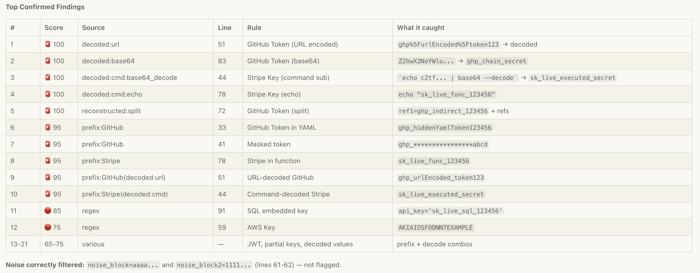

# 🔐 SecretSentry

<p align="center">
  
</p>

<p align="center">
  <b>Pipeline-based secret detection for any MCP-compatible editor.</b><br/>
  Catches hardcoded secrets even when they're encoded, split, obfuscated, or hidden in command substitutions.
</p>

<p align="center">
  <code>50+ regex rules</code> · <code>35+ provider prefixes</code> · <code>6-stage pipeline</code> · <code>0-100 confidence scoring</code>
</p>

---

## Quick Start

```bash
# Prerequisites: Python 3.10+, uv
uv run secret-sentry/server.py
```

Add to your MCP client config:

```json
{
  "mcpServers": {
    "secret-sentry": {
      "command": "uv",
      "args": ["run", "/path/to/secret-sentry/server.py"]
    }
  }
}
```

Works with [Claude Desktop](https://claude.ai/download), [Cursor](https://cursor.sh), [Kiro](https://kiro.dev), [VS Code + Continue](https://continue.dev), and any [MCP-compatible](https://modelcontextprotocol.io/) client.

---

## Sample Output

<p align="center">
  
</p>

---

## Tools

| Tool | Description |
|------|-------------|
| `scan_code` | Scan a code snippet directly |
| `scan_file` | Scan a file on disk by path |
| `scan_directory` | Scan an entire project (auto-skips binaries, node_modules, .git, build dirs) |
| `check_entropy` | Analyze a string's Shannon entropy + prefix intelligence |

---

## How It Works

SecretSentry runs every scan through a 6-stage pipeline:

```
Raw Code
  → 1. NORMALIZE     unicode escapes, hex escapes, confusable chars
  → 2. DECODE        base64, hex, URL encoding, chained transforms (3 layers), command substitution
  → 3. RECONSTRUCT   string concat, split assignments, array fragments
  → 4. PREFIX MATCH  35+ known provider prefixes (AWS, GitHub, Stripe, Slack, etc.)
  → 5. REGEX MATCH   50+ pattern rules across 15+ categories
  → 6. SCORE         confidence 0-100 with noise filtering
  → Output           tabular results sorted by confidence
```

Each stage feeds the next — so a base64-encoded, array-split Stripe key gets decoded, reconstructed, prefix-matched, AND regex-matched, with the confidence score reflecting all signals.

---

## What It Detects

| Category | Examples |
|----------|---------|
| Cloud Keys | AWS (`AKIA`), GCP (`AIza`), Azure Storage/Connection Strings |
| VCS Tokens | GitHub (`ghp_`, `gho_`, `ghu_`), GitLab (`glpat-`) |
| Payment | Stripe (`sk_live_`, `rk_live_`), PayPal, Square |
| Communication | Slack (`xoxb-`), Discord webhooks, Twilio, SendGrid, Mailgun |
| Monitoring | Datadog, New Relic, Sentry DSN |
| Database | MongoDB/Postgres/MySQL/Redis/AMQP connection strings, JDBC |
| Crypto | RSA/EC/DSA/OpenSSH/PGP private keys, encryption keys |
| Auth | JWTs, hardcoded passwords/secrets/tokens |
| Registry | npm, PyPI, Docker Hub tokens |
| Android | Manifest API keys, BuildConfig secrets, Firebase inline config |
| Infra | Hardcoded IPs, URLs with embedded credentials |
| Obfuscated | Base64/hex/URL-encoded secrets, split strings, command substitutions |

---

## Confidence Scoring

Every finding gets a 0-100 score based on 8 factors:

| Factor | Effect |
|--------|--------|
| Pattern strength | Rule-specific base score (15-98) |
| Entropy + length | High entropy + long → strong signal; low entropy + long → noise penalty |
| Keyword proximity | Near "password", "secret", "token" → boost |
| Context | Test file, placeholder, comment, env var reference → penalty |
| Noise filter | Repeating chars, sequential patterns, all-digits → heavy penalty |
| Nearby lines | Multiple secret-related lines nearby → boost |
| Combined signal | High entropy + keyword + not test → extra boost |
| Hidden bonus | Decoded/reconstructed secrets → +5 (obfuscation = more suspicious) |

| Score | Severity |
|-------|----------|
| 90-100 | 🚨 CRITICAL |
| 70-89 | 🔴 HIGH |
| 50-69 | 🟡 MEDIUM |
| 30-49 | 🟢 LOW |
| 0-29 | ℹ️ INFO |

Results are split into **Confirmed Findings** and **Possible Candidates**. Findings below 15 are suppressed.

---

## Project Structure

```
secret-sentry/
├── server.py                    # Entry point (uv run)
├── pyproject.toml
├── README.md
├── ROADMAP.md                   # Vulnerability scanning roadmap
├── img/
└── src/secret_sentry/
    ├── __init__.py
    ├── models.py                # ScanContext dataclass
    ├── utils.py                 # Entropy, masking, helpers
    ├── pipeline.py              # 6-stage orchestrator
    ├── formatter.py             # Tabular output
    ├── server.py                # MCP tool definitions
    └── stages/
        ├── normalize.py         # Stage 1
        ├── decode.py            # Stage 2
        ├── reconstruct.py       # Stage 3
        ├── prefix.py            # Stage 4
        ├── regex.py             # Stage 5
        └── score.py             # Stage 6
```

---

## Sharing / Distribution

```bash
# PyPI
pip install build twine && python -m build && twine upload dist/*

# Others use it with:
uvx secret-sentry
```

Or share the Git repo — others clone and point their MCP config to `server.py`.

---

## Roadmap

See [ROADMAP.md](ROADMAP.md) for the full vulnerability scanning expansion plan.

| Status | Feature |
|--------|---------|
| ✅ | 6-stage pipeline with confidence scoring |
| ✅ | 50+ regex rules, 35+ provider prefixes |
| ✅ | Base64/hex/URL decoding with 3-layer chaining |
| ✅ | String reconstruction (concat, split, array) |
| ✅ | Command substitution simulation |
| ✅ | Noise filtering (repeating chars, sequential patterns) |
| ✅ | Modular `src/` package structure |
| 🔜 | Dependency CVE scanning (Phase 1) |
| 🔜 | Code vulnerability patterns — SQLi, XSS, etc. (Phase 2) |
| 🔜 | Config file scanning — Dockerfile, K8s, Terraform (Phase 3) |
| 📋 | AST-based SAST with tree-sitter (Phase 4) |
| 📋 | Supply chain & license checks (Phase 5) |
| 📋 | Git pre-commit hook, baseline/allowlist, SARIF output |

---

## Known Limitations

- No semantic/data-flow analysis (can't trace variables across functions)
- XOR/encryption obfuscation bypasses detection
- Single-file context (no cross-file tracking)
- Command simulation is pattern-based, not execution-based

## License

MIT
